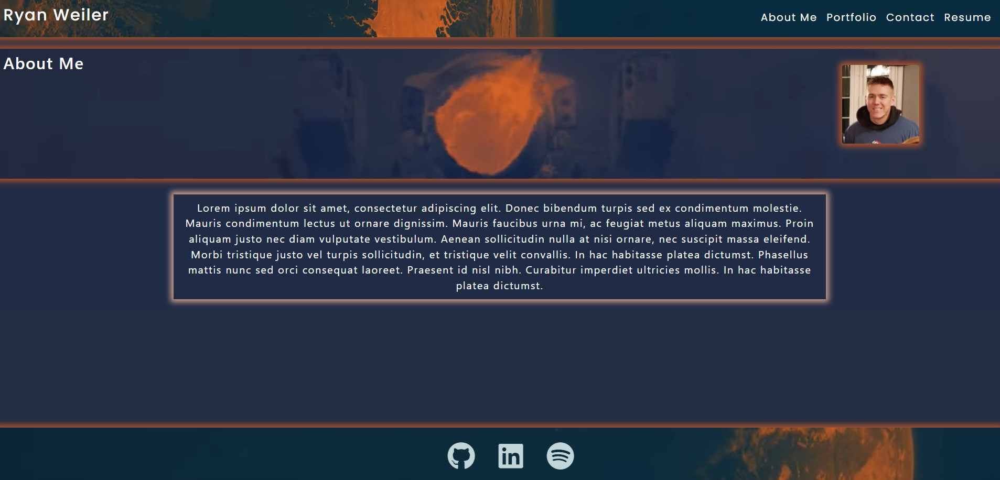

# Ryan Weiler React Portfolio

## Questions
* GitHub User Name: [ryanweiler92](https://github.com/ryanweiler92)
* Repository Link: [Ryan-Weiler-React-Portfolio](https://github.com/ryanweiler92/Ryan-Weiler-React-Portfolio/tree/main/photo-port)
* Application Link: [[Ryan-Weiler-React-Portfolio]()
* For any additional questions please reach out to ryanweiler92@gmail.com.

## Description
An application to display my current skills and projects while providing a brief bio of myself.

## Table of Contents
* [Installation](#installation)
* [Usage](#usage)
* [Contributors](#contributors)
* [Tests](#tests)
* [License](#license)

## Installation
No installation is required. 

## Usage

## Contributors
Ryan Weiler

## Tests 
No testing available at this time.

## License
 